# Webots 安装教程

流程基本按照 CSDN https://blog.csdn.net/crp997576280/article/details/105122098

有一些小改动

## 1.下载仿真软件

此处下载的是webots_2020b-rev1_amd64.deb 版本

https://github.com/cyberbotics/webots/releases/


下载deb包以后

***step 1*** 把 **webots_2020b-rev1_amd64.deb** 文件拷贝到 ***home*** 目录下面
***step 2*** 新建一个终端运行以下指令

```bash
sudo apt install ./webots_2020b-rev1_amd64.deb
```

***step 2*** 在Applications 搜索 webots 进行启动


## 2.安装 webots-ros

打开终端输入命令

```
sudo sh -c 'echo "deb http://packages.ros.org/ros/ubuntu $(lsb_release -sc) main" > /etc/apt/sources.list.d/ros-latest.list'
sudo apt-key adv --keyserver 'hkp://keyserver.ubuntu.com:80' --recv-key C1CF6E31E6BADE8868B172B4F42ED6FBAB17C654
sudo apt-get update
sudo apt-get install ros-melodic-desktop-full # takes time, get a coffee :)
sudo apt-get install python-rosdep
sudo rosdep init
rosdep update
sudo apt-get install ros-melodic-webots-ros
```

* 检查路径，输入

```
$ROS_PACKAGE_PATH
```

得到的结果应该为 /home/youruser/catkin_ws/src:/opt/ros/melodic/share

* 设置环境变量：将以下命令加入到 .zshrc或 .bashrc后面

```
export WEBOTS_HOME=/usr/local/webots
source opt/ros/melodic/setup.zsh
```

### webots_ros路径

```
/usr/local/webots/projects/languages/ros/webots_ros
```

## 3.与ROS进行通信

例程：运行

```
roslaunch webots_ros pioneer3at.launch
```

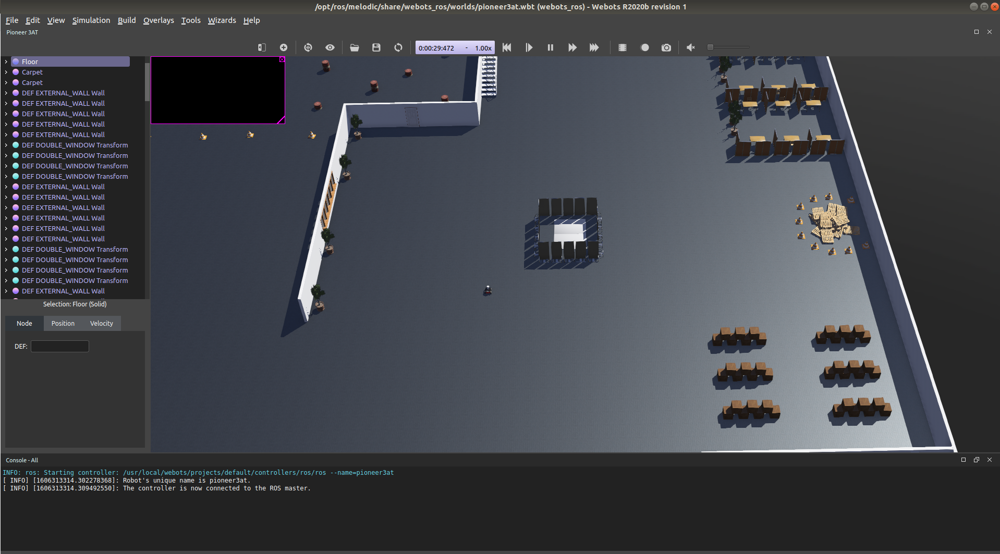

小车车会动起来到处跑

此时查看webots发布的话题，有

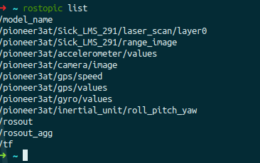

* 键盘遥控机器人

```
roslaunch webots_ros keyboard_teleop.launch
```

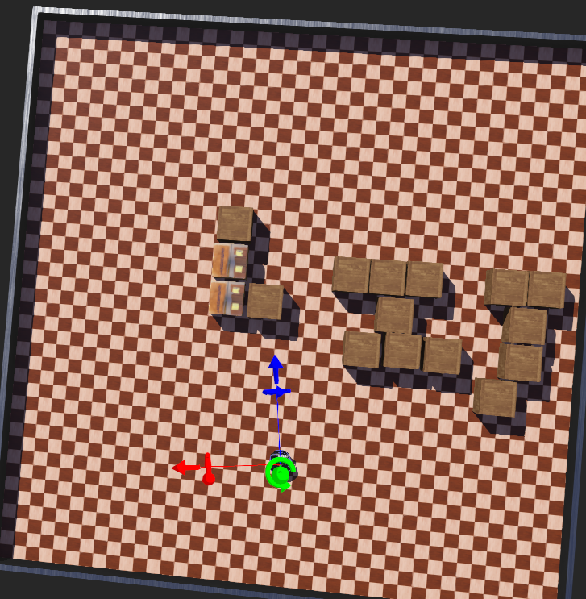

通过这个命令会自动启动webots客户端，然后用鼠标选中webots界面，这时候利用键盘上的方向键就可以控制机器人前后左右移动了。而键盘的数据会发送在一个名为 ***“/XXX/keyboard/key”*** 的话题上。


## 4.新建模型

打开webots

```
Wizards-New Project Directory
```

此目录存放新建的world模型及相关文件


点击第二个加号可以添加模型，模型可以搜索

常用的：floor，woodenbox，e-puck等

左边栏可以修改大小、颜色、位姿、物理性质等参数。

每次保存前记得点reload，save到指定路径即可。

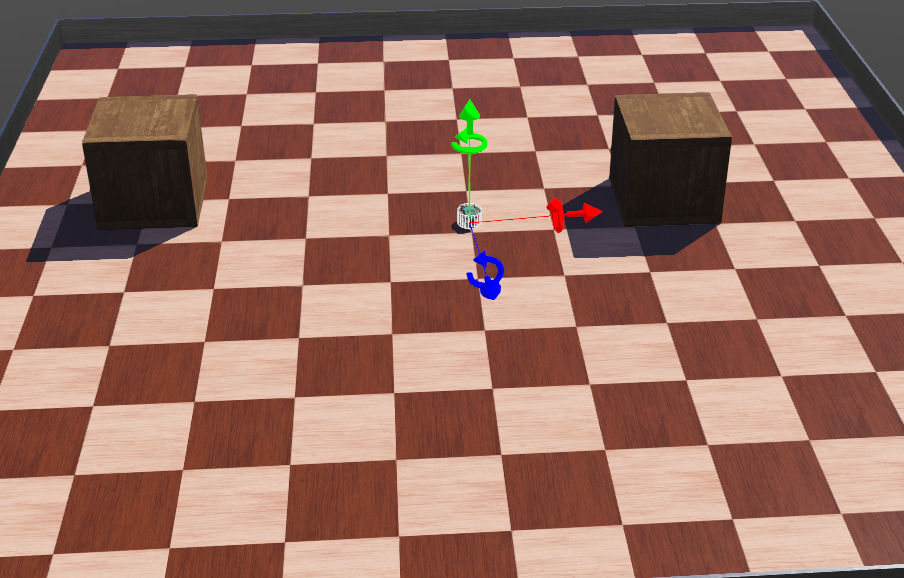


## 5.新建自己的控制器

Wizards->New Robot Controller 菜单栏新建一个机器人控制器，保存为 ***my_controller*** 。这里支持C、C++、JAVA、MATLAB的语言进行新建，这时候会再右侧栏出现机器人控制器的编程界面。

这里为了演示功能我直接复制了原有的 e-puck 控制器的内容，当我们对控制器进行编写完成以后，我们需要指定机器人使用我们新建的控制器,如下图所示，这时候选中我们自己新建的（***my_controller***）


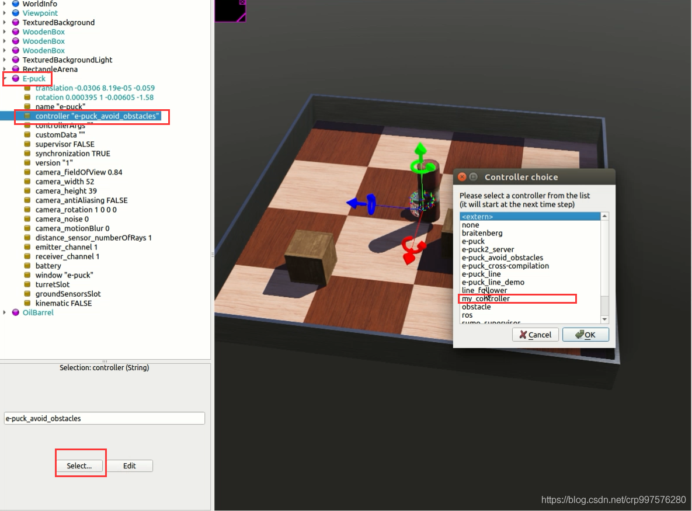


### E-puck控制器代码

```c++
/*
 * Copyright 1996-2020 Cyberbotics Ltd.
 *
 * Licensed under the Apache License, Version 2.0 (the "License");
 * you may not use this file except in compliance with the License.
 * You may obtain a copy of the License at
 *
 *     http://www.apache.org/licenses/LICENSE-2.0
 *
 * Unless required by applicable law or agreed to in writing, software
 * distributed under the License is distributed on an "AS IS" BASIS,
 * WITHOUT WARRANTIES OR CONDITIONS OF ANY KIND, either express or implied.
 * See the License for the specific language governing permissions and
 * limitations under the License.
 */

/*
 * Description:  Default controller of the e-puck robot
 */

/* include headers */
#include <stdio.h>
#include <stdlib.h>
#include <string.h>
//webots的头文件
#include <webots/device.h>
#include <webots/distance_sensor.h>
#include <webots/led.h>
#include <webots/motor.h>
#include <webots/nodes.h>
#include <webots/robot.h>

/* Device stuff */
//WbDeviceTag 是一个句柄，用于给simulator编号，必须由 wb_robot_get_device 获取得到
#define DISTANCE_SENSORS_NUMBER 8
static WbDeviceTag distance_sensors[DISTANCE_SENSORS_NUMBER];
static double distance_sensors_values[DISTANCE_SENSORS_NUMBER];
static const char *distance_sensors_names[DISTANCE_SENSORS_NUMBER] = {"ps0", "ps1", "ps2", "ps3", "ps4", "ps5", "ps6", "ps7"};

#define GROUND_SENSORS_NUMBER 3
static WbDeviceTag ground_sensors[GROUND_SENSORS_NUMBER];
static double ground_sensors_values[GROUND_SENSORS_NUMBER] = {0.0, 0.0, 0.0};
static const char *ground_sensors_names[GROUND_SENSORS_NUMBER] = {"gs0", "gs1", "gs2"};

#define LEDS_NUMBER 10
static WbDeviceTag leds[LEDS_NUMBER];
static bool leds_values[LEDS_NUMBER];
static const char *leds_names[LEDS_NUMBER] = {"led0", "led1", "led2", "led3", "led4", "led5", "led6", "led7", "led8", "led9"};

static WbDeviceTag left_motor, right_motor;

#define LEFT 0
#define RIGHT 1
#define MAX_SPEED 6.28
static double speeds[2];

/* Breitenberg stuff */
static double weights[DISTANCE_SENSORS_NUMBER][2] = {{-1.3, -1.0}, {-1.3, -1.0}, {-0.5, 0.5}, {0.0, 0.0},
                                                     {0.0, 0.0},   {0.05, -0.5}, {-0.75, 0},  {-0.75, 0}};
static double offsets[2] = {0.5 * MAX_SPEED, 0.5 * MAX_SPEED};

static int get_time_step() {
  static int time_step = -1;
  if (time_step == -1)
    time_step = (int)wb_robot_get_basic_time_step(); //This function returns the value of the basicTimeStep field of the WorldInfo node.返回“世界“中的采样时间
  return time_step;
}

static void step() {
  if (wb_robot_step(get_time_step()) == -1) {
    wb_robot_cleanup();
    exit(EXIT_SUCCESS);
  }
}

static void passive_wait(double sec) {
  double start_time = wb_robot_get_time();
  do {
    step();
  } while (start_time + sec > wb_robot_get_time());
}

static void init_devices() {
  int i;
//构建操作句柄，使能距离传感器和LED传感器
  for (i = 0; i < DISTANCE_SENSORS_NUMBER; i++) {
    distance_sensors[i] = wb_robot_get_device(distance_sensors_names[i]);//获取传感器编号
    wb_distance_sensor_enable(distance_sensors[i], get_time_step());//第二个参数为采样时间，单位ms
  }
  for (i = 0; i < LEDS_NUMBER; i++)
    leds[i] = wb_robot_get_device(leds_names[i]);

  // silently initialize the ground sensors if they exists
  for (i = 0; i < GROUND_SENSORS_NUMBER; i++)
    ground_sensors[i] = (WbDeviceTag)0;
  int ndevices = wb_robot_get_number_of_devices();
  for (i = 0; i < ndevices; i++) {
    WbDeviceTag dtag = wb_robot_get_device_by_index(i);
    const char *dname = wb_device_get_name(dtag);
    WbNodeType dtype = wb_device_get_node_type(dtag);
    if (dtype == WB_NODE_DISTANCE_SENSOR && strlen(dname) == 3 && dname[0] == 'g' && dname[1] == 's') {
      int id = dname[2] - '0';
  //迷糊，前面是在干嘛，判断ground sensors是否存在吗？
      if (id >= 0 && id < GROUND_SENSORS_NUMBER) {
        ground_sensors[id] = wb_robot_get_device(ground_sensors_names[id]);
        wb_distance_sensor_enable(ground_sensors[id], get_time_step());
      }
    }
  }

  // get a handler to the motors and set target position to infinity (speed control).
  left_motor = wb_robot_get_device("left wheel motor");
  right_motor = wb_robot_get_device("right wheel motor");
  wb_motor_set_position(left_motor, INFINITY);
  wb_motor_set_position(right_motor, INFINITY);
  wb_motor_set_velocity(left_motor, 0.0);
  wb_motor_set_velocity(right_motor, 0.0);

  step();
}
//重置执行器（电机和LED）
static void reset_actuator_values() {
  int i;
  //电机速度设为0
  for (i = 0; i < 2; i++)
    speeds[i] = 0.0;
  //LED灯设0，不亮
  for (i = 0; i < LEDS_NUMBER; i++)
    leds_values[i] = false;
}

static void get_sensor_input() {
  int i;
  //用wb_distance_sensor_get_value获取距离传感器的值，并保存在distance_sensors_values中
  for (i = 0; i < DISTANCE_SENSORS_NUMBER; i++) {
    distance_sensors_values[i] = wb_distance_sensor_get_value(distance_sensors[i]);

    // scale the data in order to have a value between 0.0 and 1.0（归一化，使传感器值在0~1之间）
    // 1.0 representing something to avoid, 0.0 representing nothing to avoid（传感器值越大，代表越需要避障）
    distance_sensors_values[i] /= 4096;
  }
  //获取ground sensor的值
  for (i = 0; i < GROUND_SENSORS_NUMBER; i++) {
    if (ground_sensors[i])
      ground_sensors_values[i] = wb_distance_sensor_get_value(ground_sensors[i]);//Ground Sensor仍然使用的是distance类型
  }
}
//检测悬崖?
static bool cliff_detected() {
  int i;
  for (i = 0; i < GROUND_SENSORS_NUMBER; i++) {
    if (!ground_sensors[i])
      return false;
    if (ground_sensors_values[i] < 500.0)
      return true;
  }
  return false;
}
//设置执行器的值（LED亮或不亮，以及电机转速）
static void set_actuators() {
  int i;
  for (i = 0; i < LEDS_NUMBER; i++)
    wb_led_set(leds[i], leds_values[i]);
  wb_motor_set_velocity(left_motor, speeds[LEFT]);
  wb_motor_set_velocity(right_motor, speeds[RIGHT]);
}

static void blink_leds() {
  static int counter = 0;
  counter++;
  leds_values[(counter / 10) % LEDS_NUMBER] = true;
}

static void run_braitenberg() {
  int i, j;
  for (i = 0; i < 2; i++) {
    speeds[i] = 0.0;
    for (j = 0; j < DISTANCE_SENSORS_NUMBER; j++)
      speeds[i] += distance_sensors_values[j] * weights[j][i];

    speeds[i] = offsets[i] + speeds[i] * MAX_SPEED;
    if (speeds[i] > MAX_SPEED)
      speeds[i] = MAX_SPEED;
    else if (speeds[i] < -MAX_SPEED)
      speeds[i] = -MAX_SPEED;
  }
}

static void go_backwards() {
  wb_motor_set_velocity(left_motor, -MAX_SPEED);
  wb_motor_set_velocity(right_motor, -MAX_SPEED);
  passive_wait(0.2);
}

static void turn_left() {
  wb_motor_set_velocity(left_motor, -MAX_SPEED);
  wb_motor_set_velocity(right_motor, MAX_SPEED);
  passive_wait(0.2);
}


int main(int argc, char **argv) {
  wb_robot_init();

  printf("Default controller of the e-puck robot started...\n");

  init_devices();

  while (true) {
    reset_actuator_values();
    get_sensor_input();
    blink_leds();
    if (cliff_detected()) {
      go_backwards();
      turn_left();
    } else {
      run_braitenberg();
    }
    set_actuators();
    step();
  };

  return EXIT_SUCCESS;
}

```

## 6.建立自己的四轮小车

[Webots 机器人仿真平台(五) 新建四轮小车模型](https://blog.csdn.net/crp997576280/article/details/105537639)
[Webots 机器人仿真平台(六) 新建四轮小车控制器](https://blog.csdn.net/crp997576280/article/details/105580260)
[Webots 机器人仿真平台(七) 键盘控制小车](https://blog.csdn.net/crp997576280/article/details/105661899)
[Webots 机器人仿真平台(八) 添加GPS传感器](https://blog.csdn.net/crp997576280/article/details/105658021)
[Webots 机器人仿真平台(九) 添加IMU传感器](https://blog.csdn.net/crp997576280/article/details/105667450)
[Webots 机器人仿真平台(十) 添加camera相机](https://blog.csdn.net/crp997576280/article/details/105756733)
[Webots 机器人仿真平台(十一) 添加激光传感器（laser）](https://blog.csdn.net/crp997576280/article/details/105761752)

### 问题：原地转向时每90度出现停顿

Webots搭建的四轮差速小车在原地转向时，每90度出现停顿的解决方法 https://www.codenong.com/cs106488470/

ContactProperties节点用于定义Solid节点(或Solid派生的任何节点)之间接触时的接触属性。

coulombFriction字段是库仑摩擦系数。取值范围在0到正无穷的范围内(正无穷用-1表示)。0产生无摩擦接触，正无穷产生永不滑动的接触。

forceDependentSlip字段定义力依赖滑移(FDS)。当两物体相接触时，当受到接触面切向方向的力时，两物体有相互滑动的趋势。若两物体之间的摩擦系数无穷大，则施加切向力 f 后二者并不会相互滑动。如果设置FDS系数为正值k，那么两个表面就会相互滑动，滑动速度为 k×f。


### 问题：穿模

shape或solid同级的boundingObject要设置为Shape对应的名字，同时添加物理属性，如下

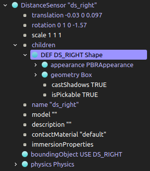

### 问题：如何将IMU,gyro,accelerometer,compass组合

可以新建一个Robot节点，其children包含以上四个传感器。

注意：

* 要给该robot设置物理属性
* 如果要寻找该robot对应的传感器名称，可将代码写在一个控制器中，并在该robot下的控制器一栏选择该控制器
* 能否将该小控制器写在外面的大控制器内部？

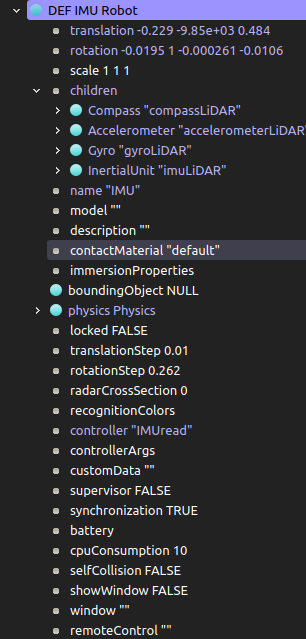

### 问题：WorldInfo和ViewPoint的参数

WorldInfo中的basicTimeStep代表仿真的最小时间步长，单位为ms

ViewPoint中的follow可以填入机器人的名字，达到视角跟随机器人的目的。

## 问题：Webots中的Y轴向上

Webots的一个非常搞人的坑就是，它定义的坐标系y轴向上，在进行控制时注意进行必要的坐标变换。

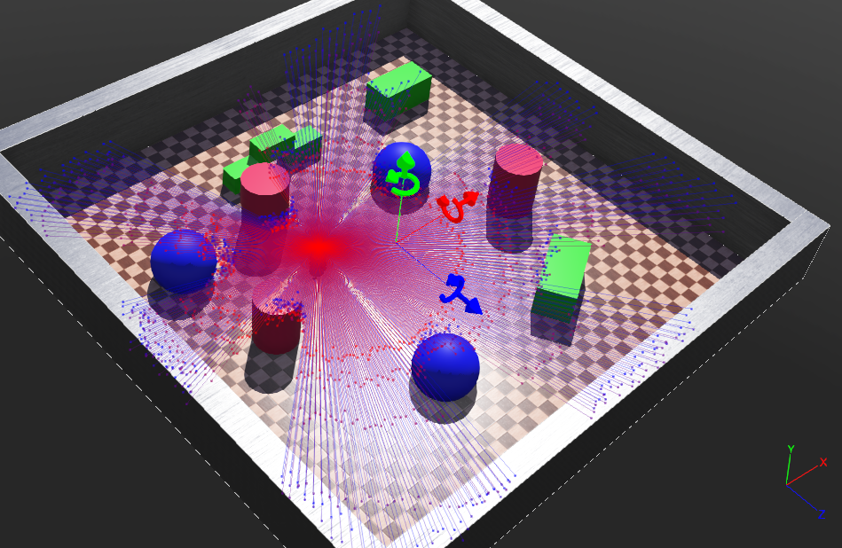

## 7. 新建ROS控制器

### 将webots_ros放到工作空间

如果用1.中的命令的方法安装webots_ros，其安装目录为

```
/usr/local/webots/projects/languages/ros/webots_ros
```

此路径由于权限原因，添加新的可执行文件不太方便，所以可将 webots_ros 这个package复制到工作空间，方法如下

```
可以去 
usr/local/webots/projects/languages/ros
将webots_ros和拷贝到工作空间下,并且去
usr/local/webots/projects/default/controllers/ros/include
路径里面将msg，srv拷贝到刚才的webots_ros里,如下
```

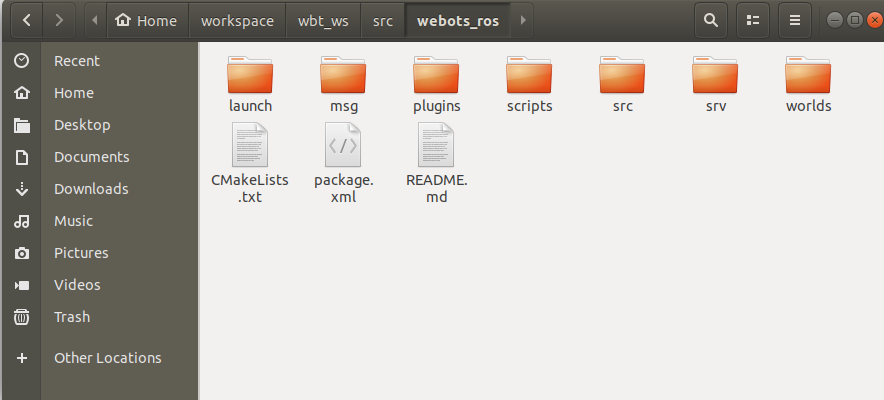

接着，在src目录新建ros控制器，以ugly_car.cpp为例

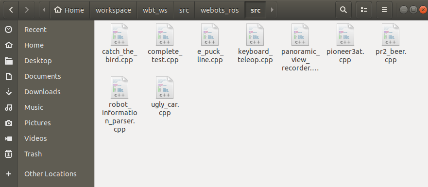

其内容和代码具体解释参见https://blog.csdn.net/crp997576280/article/details/106335919

同时配置CMakeLists.txt，添加可执行文件和依赖

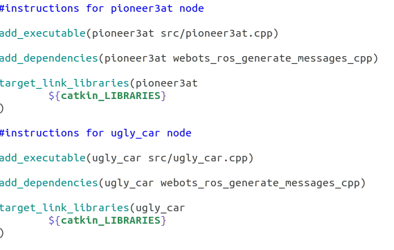

完成之后，编译工作空间，完成后，在建立好的模型中将controller修改为ros

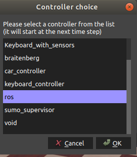


同时控制器参数部分输入

```
--name=ugly_car
```

此参数可以理解为控制器的名字，webots按照这个名字去寻找相应的节点，完成匹配，实施控制

### 运行ros控制器

```
roscore //启动ros
打开webots，file-open world 打开对应的模型
rosrun webots_ros ugly_car //小车就会动起来啦
```

### 控制代码分析

Webots以服务的方式与ROS节点进行数据交换，如上面的控制器，运行后 rosservice list 会出现

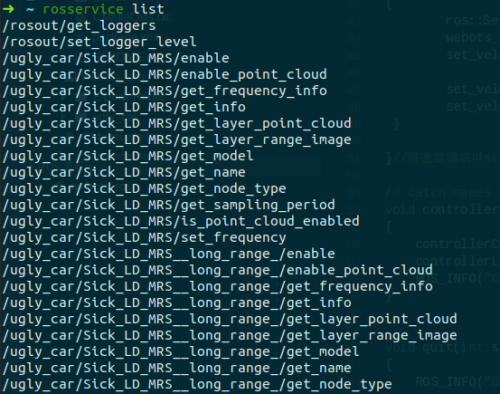

ROS 节点通过调用指定的服务来实现与webots数据交换,而这个服务的名称通常是

webots中**控制器**的名称(在这篇博客前面设置的参数--name=ugly_car)+ **设备名称**（如轮子的名称为"wheel1"）+**操作名称**(如 “/set_position”)
如下得到一个值: ***"ros_test/wheel1/set_position"***

**如果说rosservice类似于rostopic，提供各种各样丰富的功能，那么rossrv就和rosmsg类似，用于分别描述rosservice和rosmsg的类型**

|      指令       |                             功能                             |              示例              |
| :-------------: | :----------------------------------------------------------: | :----------------------------: |
| rosservice list |                        查看所有的服务                        |                                |
| rosservice type |                        查看服务的类型                        |    输出webots_ros/set_float    |
|   rossrv show   | 查看服务对应类型的数据结构，输出为请求(request)、分隔符、返回值(response) | float64 value --- bool success |
| rosservice call |                          调用某服务                          |                                |

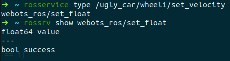

与publishers/subscribers的通信机制相比，services/clients通信机制是一种**双向**、**一对一**的**可靠**通信机制。
当client发送一个“请求”（request）到service处，service会反馈一个“响应”（response）给client，这时的client就需要知道service的名称才能完成这种问答形式的通信机制。

| 类型 |                  |         |                 |
| :--: | :--------------: | :-----: | :-------------: |
| 话题 | publisher (pub)  |  topic  | (to) subscriber |
| 服务 | client (request) | service |  (from) server  |


## 小车模型 ugly_car

```
roslaunch webots_ros ugly_car
```


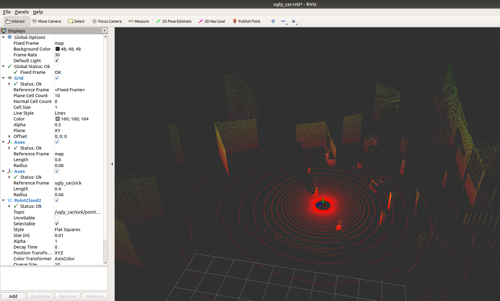